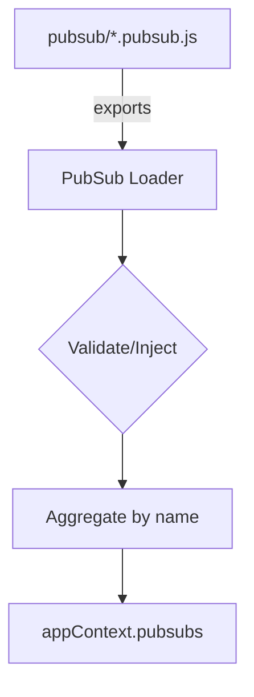
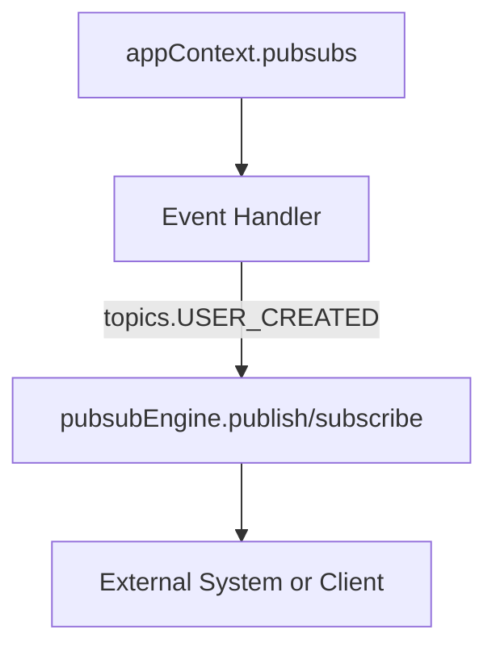

# PubSub Loader Guide

## Overview

The PubSub Loader in `guru-loaders-fp` is responsible for discovering, validating, and injecting pubsub modules into your application context. PubSub modules define topics, handlers, and options for event-driven communication within your app (e.g., for GraphQL subscriptions, event buses, or message queues).

---

## What Does the Loader Do?

- **Discovers** all files matching your pubsub patterns (e.g., `**/*.pubsub.js`).
- **Validates** that each module exports the expected shape (e.g., `name`, `topics`, `handlers`, `options`).
- **Injects** context/services into each pubsub definition if needed.
- **Aggregates** all pubsub objects into a registry, keyed by name, and attaches it to `appContext.pubsubs`.
- **Warns** on duplicate names to prevent accidental overwrites.
- **Unique features:** Supports topic registries, handler mappings, and pubsub engine options.

---

## Example: `.pubsub.js` File Structure

A pubsub module can export a factory function, a plain object, or an array of objects. Here are some common patterns:

### 1. **Factory Function (Recommended)**
```js
// user.pubsub.js
export default ({ services }) => ({
  name: 'userEvents',
  topics: {
    USER_CREATED: 'user.created',
    USER_UPDATED: 'user.updated'
  },
  handlers: {
    USER_CREATED: async (payload, context) => {
      // ...handle event
    }
  },
  options: { durable: true }
});
```

### 2. **Plain Object**
```js
// post.pubsub.js
export default {
  name: 'postEvents',
  topics: {
    POST_PUBLISHED: 'post.published'
  },
  handlers: {
    POST_PUBLISHED: async (payload, context) => { /* ... */ }
  }
};
```

### 3. **Array of PubSub Objects**
```js
// multi.pubsub.js
export default [
  {
    name: 'commentEvents',
    topics: { COMMENT_ADDED: 'comment.added' },
    handlers: { COMMENT_ADDED: async (payload, context) => { /* ... */ } }
  },
  {
    name: 'likeEvents',
    topics: { LIKE_ADDED: 'like.added' },
    handlers: { LIKE_ADDED: async (payload, context) => { /* ... */ } }
  }
];
```

### 4. **Direct PubSub Instance (Apollo, Redis, etc.)**
```js
// notifications.pubsub.js
import { PubSub } from 'apollo-server-express';
export default {
  name: 'notifications',
  pubsub: new PubSub(),
  topics: { NOTIFY: 'notify' },
  handlers: { NOTIFY: async (payload) => { /* ... */ } }
};
```

- The `pubsub` property can be any PubSub engine instance (Apollo, Redis, etc.).
- This allows you to inject and use the engine directly in your resolvers or services:
  ```js
  const pubsub = context.pubsubs.notifications.pubsub;
  pubsub.publish('NOTIFY', payload);
  ```

---

## Advanced Examples

### A. PubSub Module with Multiple Handlers and Dynamic Topics
```js
// notification.pubsub.js
export default ({ services }) => ({
  name: 'notificationEvents',
  topics: {
    NOTIFY_EMAIL: `notify.email.${services.env}`,
    NOTIFY_SMS: `notify.sms.${services.env}`
  },
  handlers: {
    NOTIFY_EMAIL: async (payload, context) => {
      await services.email.send(payload);
    },
    NOTIFY_SMS: async (payload, context) => {
      await services.sms.send(payload);
    }
  },
  options: { retry: 3 }
});
```

### B. PubSub Module for GraphQL Subscriptions
```js
// chat.pubsub.js
export default {
  name: 'chatEvents',
  topics: {
    MESSAGE_SENT: 'chat.messageSent'
  },
  handlers: {
    MESSAGE_SENT: async (payload, context) => {
      // Push to websocket, log, etc.
    }
  }
};
```

### C. Array Export for Multiple Event Domains
```js
// system.pubsub.js
export default [
  {
    name: 'systemHealth',
    topics: { HEALTH_CHECK: 'system.healthCheck' },
    handlers: { HEALTH_CHECK: async (payload) => { /* ... */ } }
  },
  {
    name: 'systemAlert',
    topics: { ALERT_RAISED: 'system.alertRaised' },
    handlers: { ALERT_RAISED: async (payload) => { /* ... */ } }
  }
];
```

---

## Diagrams

### 1. PubSub Loader Discovery and Aggregation


### 2. PubSub Usage in App


---

## Best Practice: Centralized Topic Constants

```js
// configs/pubsub-topics.js
export const USER_TOPICS = {
  CREATED: 'user.created',
  UPDATED: 'user.updated'
};
```
```js
// user.pubsub.js
import { USER_TOPICS } from '../configs/pubsub-topics.js';
export default {
  name: 'userEvents',
  topics: USER_TOPICS,
  handlers: {
    CREATED: async (payload) => { /* ... */ }
  }
};
```

---

## What Does It Mean to Have PubSubs on the appContext?

When the loader runs, it aggregates all valid pubsub objects and attaches them to `appContext.pubsubs` as a registry keyed by name:

```js
appContext.pubsubs = {
  userEvents: { name: 'userEvents', topics: { ... }, handlers: { ... }, ... },
  postEvents: { name: 'postEvents', topics: { ... }, handlers: { ... }, ... },
  // ...
};
```

This means your application can easily access any loaded pubsub object by name from anywhere in your app, enabling event-driven logic, subscriptions, or message handling.

---

## How Are PubSubs Used Throughout an App?

### 1. **In Event Handlers, Subscriptions, or Services**
```js
// Example: publishing an event
const { pubsubs } = context;
const { topics } = pubsubs.userEvents;
pubsubEngine.publish(topics.USER_CREATED, payload);

// Example: subscribing to an event
pubsubEngine.subscribe(topics.USER_CREATED, pubsubs.userEvents.handlers.USER_CREATED);
```

### 2. **Best Practices**
- **Use factory functions** to allow context injection if needed.
- **Use clear, unique names** for each pubsub object to avoid registry conflicts.
- **Document each pubsub module** with JSDoc for maintainability.
- **Avoid direct imports of pubsub modules** in business logic; always use the injected context.
- **Define all topic keys in a central config/constants file if possible.**

---

## Summary
- The pubsub loader makes it easy to register, validate, and inject all your pubsub definitions into the app context.
- Pubsubs can be accessed from anywhere in your app, supporting modular, testable event-driven logic.
- This pattern is scalable, maintainable, and a best practice for modern backends.

## Property Reference

| Property  | Type     | Required | Description                                      |
|-----------|----------|----------|--------------------------------------------------|
| name      | string   |   Yes    | Unique key for the pubsub registry               |
| topics    | object   |   No     | Event/topic keys for this pubsub                 |
| handlers  | object   |   No     | Handler functions for each topic/event           |
| pubsub    | object   |   No     | Direct PubSub engine instance (Apollo, Redis, etc.) |
| options   | object   |   No     | Additional options or metadata                   | 